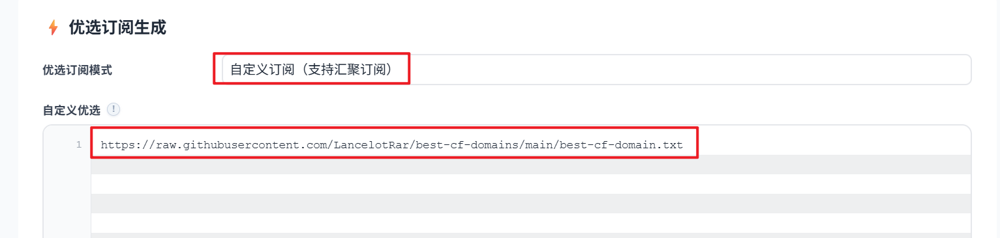

# Cloudflare 优选域名

## 优势

优选域名相对于传统的优选 IP，在实现**代理功能**方面，具有以下几个核心优势

1. 免去高频维护与“IP 失效”的烦恼

* **优选 IP 的痛点**：Cloudflare 的 Anycast IP 经常会出现变动，或者某个优选出的优质 IP 过一段时间后被运营商QoS限速、阻断（俗称“被墙”）。使用者必须经常运行脚本重新测速、更换优选 IP。
* **优选域名的优势**：优选域名通常依赖于那些在国际/国内互联表现极佳、且本身受到良好维护的“大厂”，它底层的 IP 调度和容灾由服务方或系统自动处理，**不需要用户天天操心换优选 IP**。

2. 更好的多线路、多运营商智能解析支持

* **优选 IP 的局限**：纯优选 IP 表现通常依赖特定运营商，比如电信好、联通差，或者移动好、电信差。
* **优选域名的优势**：可以直接利用成熟的多线路解析的 DNS 服务商，实现多运营商优化，对复杂网络环境的兼容性更好。

3. 绕过部分 DNS 限制与运营商封锁

* **优选 IP 的局限**：国内部分地区的运营商对 Cloudflare 官方常见的公网 IP 段（如某些敏感段或滥用严重的段）实施了严厉的阻断或严重的 TCP 丢包干扰。
* **优选域名的优势**：优选域名往往使用了一些未被重点照顾、或者网络权重更高的 Cloudflare 边缘节点入口，能够有效避开部分运营商对常规 Cloudflare IP 段的本地阻断，连接成功率更高。

## API

```
https://raw.githubusercontent.com/LancelotRar/best-cf-domains/main/best-cf-domain.txt
```

## 使用

- 可接入 [cmliu/edgetunnel](https://github.com/cmliu/edgetunnel)-自定义订阅汇聚。  
- 非即时更新，视使用体验少量更新。

<p align="center">
  
</p>

## 应用效果

- 具体表现取决于使用者当地网络环境，仅供参考。

<p align="center">
  
</p>
